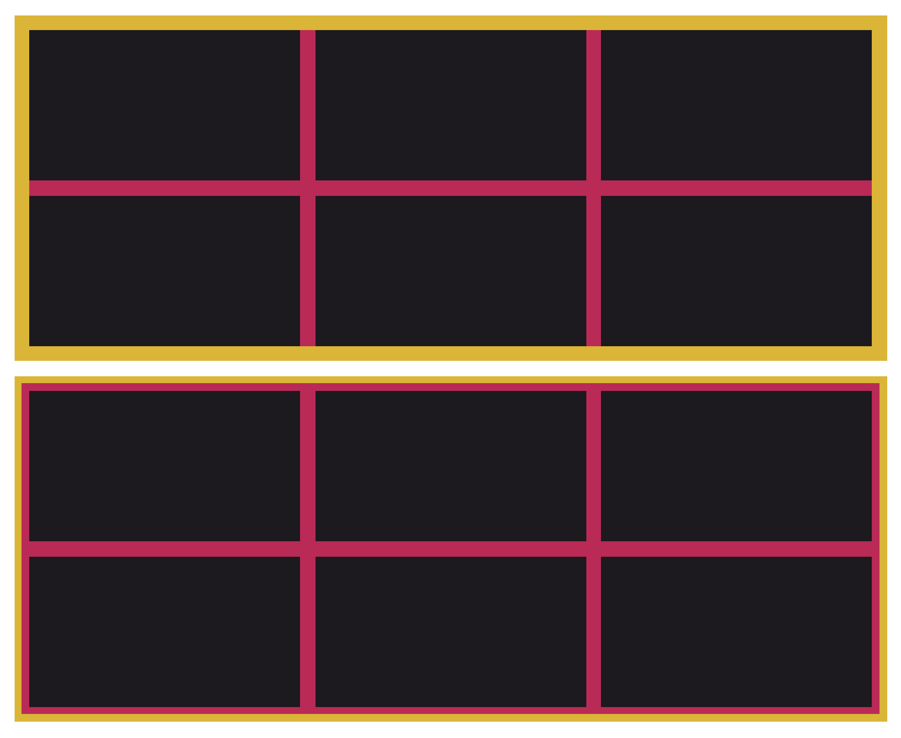

I recently have been writing a decent amount of CSS and
one of the things I have really enjoyed is the new
[grid layout](https://css-tricks.com/snippets/css/complete-guide-grid/)
and specially the [grid gap](https://developer.mozilla.org/en-US/docs/Web/CSS/gap)
property that let's you set the distance, sometimes
called `gutter`,
between the grid cells which is actually a supper common thing to do.

> **IMPORTANT** the `gap` property only modifies the **distance between cell items**,
> and it does not affect the distance of those cell items to the edges of the grid container.

It turns out that the `gap` property can also be used with
[flex layout](https://css-tricks.com/snippets/css/a-guide-to-flexbox/)
and it solves so many problems!

But there are still some browsers that don't support the `gap` property while
using the `flex layout` among which you can find `safari`,
see [compatibility table](https://developer.mozilla.org/en-US/docs/Web/CSS/gap#browser_compatibility),
so below there is a really easy method to simulate the gap between flex box items.

## With flex gap

```css
.container {
  display: flex;
  flex-direction: row;
  flex-wrap: wrap;
  /* the magic property */
  gap: 10px;

  /* demo only properties omitted */
}

.item-a {
  flex: 1;

  /* demo only properties omitted */
}
```

You get something like this:


- yellow: a trivial wrapper, not involved in the actual layout.
- pink: the flex container, it only shows through the `gaps`.
- black: the flex items.

## Without flex gap

We can easily simulate the gap property with a slightly
more complicated method of giving each item half of the
size of gap via `margin` and offsetting the container by
giving it a negative margin of that same amount.
This is because the `gap` property only affects the distance
between items and it does not affect the distance between items and
the edges of the flex container.

```css
.container {
  display: flex;
  flex-direction: row;
  flex-wrap: wrap;
  /* gap replacement, part 1 */
  margin: -5px;

  /* demo only properties omitted */
}

.item-b {
  flex: 1;
  /* gap replacement, part 2 */
  margin: 5px;

  /* demo only properties omitted */
}
```


As you can see, the flex container will eat up some space of its
parent, the `wrapper`, which is going to be most of the time necessary
to render things as you would expect with `gap`.

## Comparing

The end result is about the same, but you might need to
wrap it up in another container for more flexible composition.



## Closing

Check the [example code](https://github.com/franleplant/css-flex-gap-patch),
let me know if you have any questions.

<br/>
